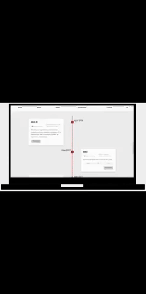

# Arloys Macias Rojas' PortFolio
1st Milestone project: User-Centric Frontend Development - Code Institute

This is where I sell myself. I have created a site with a portfolio where potential employers can find my publications, find information about me and my career as a software developer as well as my skills. It includes a section with my contact information as well as a form which can be used directly via the portfoilo.

##Demo

##UX

User Stories
As a recruiter I expect to find an attractive page that represents Arloys' skills.

As an employer I expect to see Arloys' experience easily so I can make an informed decision.

##Features

The home page has an welcoming image of me and my name as an introduction. It is in a light grey color which is suitable for both normal and high contrast screens. It is also a color which gives a modern and clean impression. The navigation bar was created after watching an online tutorial ans it and the background image is fixed adding to the modern feel.

The about section, which I think is one of the most important sections of every portfoilo, gives simple background information about me. It is simple and natural, using font 'Roboto' which is attractive and easily read to not distract the reader from the information. 

In the skill section I used the 'progress bars' that Bootstrap provides to show my relevant developer's skills. I modified them to fit my site by overriding the original code by changing color to fit the site color scheme (red, white and gray) and used the grid system provided by Bootstrap (https://www.layoutit.com/build) to making them responsive to fit every type of screen.

The publications section shows chronologically some of my publications. This was achieved through a combination of Code Institute provided classes, W3Schools (https://www.w3schools.com/default.asp) and CREATIVOSONLINE (https://www.creativosonline.org/blog/timeline-css.html), to create a timeline suitable to my content, add the link buttons and change the color to fit the site theme.

The contact section provides my contact information as well as a form for visitors to contact me directly. The form is correctly validated and helps the used provide the correct information using the correct type in each field of the form (input). Here  the visitor can also find links to my social media platforms.

The footer sections shows the year of the copywrite stating my exclusive ownership of the site.
