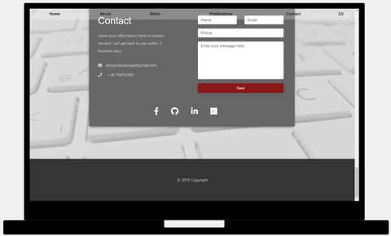
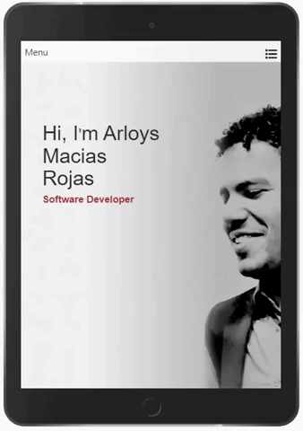

# Arloys Macias Rojas Portfolio
1st Milestone project: User-Centric Frontend Development - Code Institute

This is where I sell myself. I have created a site with a portfolio where potential employers can find my publications, find information about me and my career as a software developer as well as my skills. It includes a section with my contact information as well as a form which can be used directly via the portfoilo.

## Demo

### Desktop/Mobile/Tablet view

## UX

### User Stories
As a recruiter I expect to find an attractive page that represents Arloys' skills.

As an employer I expect to see Arloys' experience easily so I can make an informed decision.

### Strategy
I wanted to make an attractive and simple site to capture the attention of potential employers.

### Scope
The site gives easy access to employers and recruiters where they can find information about me and my experience, skills and publications, as well as contact me if they are interested.

### Structure
In the 'Publications' section of my site, employers can easily find information through clickable links to my published articles. In the 'Contact' section they can find clickable links to my LinkedIn profile, GitHub and ResearchGate. I have also provided a downloadable pdf version of my CV.

### Skeleton

- <a href="https://github.com/ArloysMacias/PortFolio2/blob/master/assets/images/image-Design.jpg" target="blank">Desktop wireframe</a>

- <a href="https://github.com/ArloysMacias/PortFolio2/blob/master/assets/images/movilwireframe.jpg" target="blank">Mobile/Tablet wireframe</a> 

### Surface

In the design of the site I chose to use grey tones with added red elements for an attractive and modern feel.

## Features

### Existing Features

- The 'Home' page has an welcoming image of me and my name as an introduction. It is in a light grey color which is suitable for both normal and high contrast screens. It is also a color which gives a modern and clean impression. The navigation bar was created after watching an online tutorial ans it and the background image is fixed adding to the modern feel.

- The'About' section, which I think is one of the most important sections of every portfoilo, gives simple background information about me. It is simple and natural, using font 'Roboto' which is attractive and easily read to not distract the reader from the information. 

- In the 'Skill' section I used the 'progress bars' that Bootstrap provides to show my relevant developer's skills. I modified them to fit my site by overriding the original code by changing color to fit the site color scheme (red, white and gray) and used the grid system provided by Bootstrap (https://www.layoutit.com/build) to making them responsive to fit every type of screen.

- The 'Publications' section shows chronologically some of my publications. This was achieved through a combination of Code Institute provided classes, W3Schools (https://www.w3schools.com/default.asp) and CREATIVOSONLINE (https://www.creativosonline.org/blog/timeline-css.html), to create a timeline suitable to my content, add the link buttons and change the color to fit the site theme.

- The 'Contact' section provides my contact information as well as a form for visitors to contact me directly. The form is correctly validated and helps the used provide the correct information using the correct type in each field of the form (input). Here  the visitor can also find links to my social media platforms.

- The 'Footer' sections shows the year of the copywrite stating my exclusive ownership of the site.

### Features Left to Implement

I would like to add the option of changing the language of the page to Spanish since this is my mother tongue. Likewise, it is my intention to add future projects I create in this portfoilo.

## Technologies Used

- Bootstrap
- CSS3
- HTML5
- JavaScript

## Testing

This site was tested with the inspection function of Chrome and Firefox and the featured mobile view that they provide (iphone 6, 7, 8 plus and ipad). No issues were detected during the testing. Neither were any issues found when tests were performed in devices with high contrast since the site color scheme is in a simple gray scale. 

All the links in the 'Publications' section were tested to make sure they redirected to the correct publications website, as well as the link in the navigation bar to a downloadable pdf version of the CV.

All the fields in the contact form are validated using the 'required' attribute and the appropiate 'type' (text, email, number, message) avoiding users inputting the wrong information. If the correct information is filled in the form will redirect to the user's default email service provider to send.

## Deployment

This site was developed on GitPod online IDE and hosted on the GitHub platform. It is using the master branch which allows every change, commit and push to show immediately in real time to users. 

To run the site locally the user can paste https://arloysmacias.github.io/Arloys-Portfolio/ in the browser. To Clone with HTTPS the user can use git using the web URL: https://github.com/ArloysMacias/Arloys-Portfolio.git .

## Credits

### Content

The information in the 'About' section was written by me. The published articles in the 'Publications' section was written by me in collaboration with several different authors credited in the articles themselves.

### Media

The image of me is created from a private photo but the background of the 'Skills' and 'Contact' section was downloaded from Pexels (https://www.pexels.com/photo/white-coumputer-keyboard-34490/).

### Acknowledegments

To make the navigation bar I watched a tutorial made by Falcon Masters: https://www.youtube.com/watch?v=z-CPRslZS_A

The bars showing the skills were made using Bootstrap: https://getbootstrap.com/docs/4.3/components/progress/

The design of the time line in the 'Publications' section was inspired by: https://gist.github.com/CodeMyUI/258edf8a49787f76e7b41761eea612f6

The project was inspired by the example provided by Code Institute.